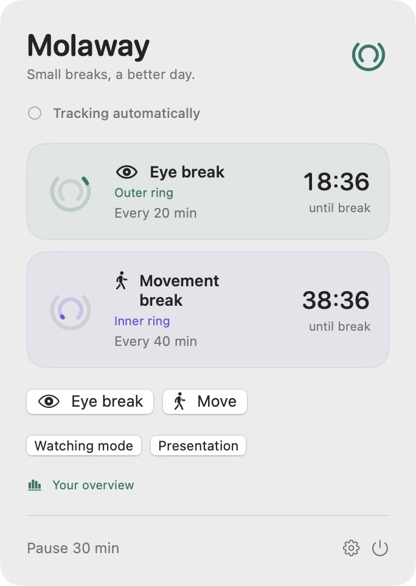
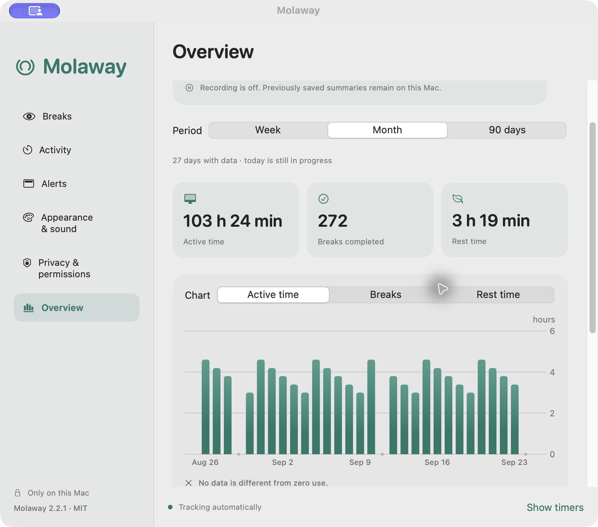
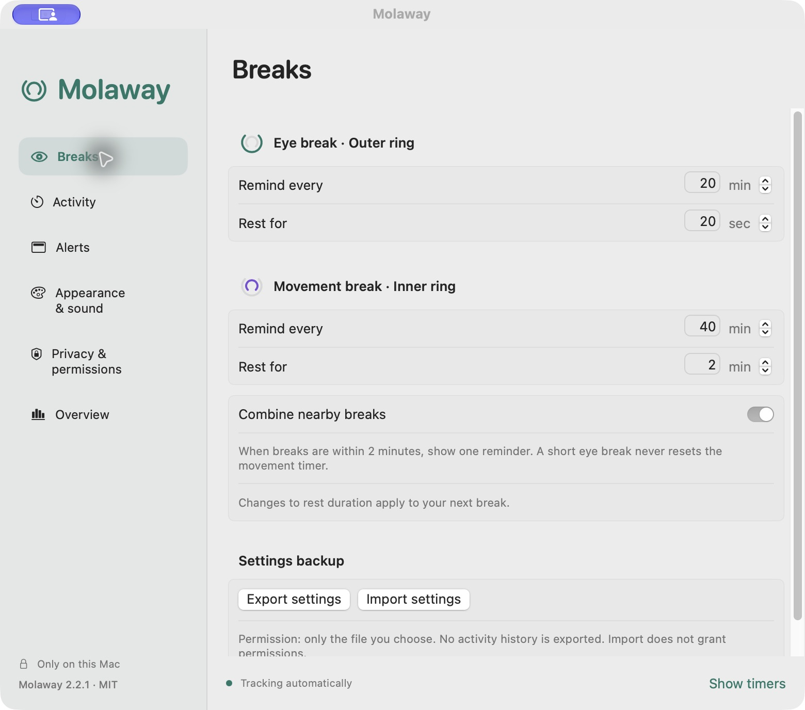

# Molaway

A personal derivative of **[Offscreen](https://github.com/dayaki/offscreen)** by **[Dayo Akinkuowo](https://github.com/dayaki)**, under the [MIT license](LICENSE). Molaway adaptations are by Burak Yelkenci, with ChatGPT/Codex assistance. [What comes from Offscreen and what changed](UPSTREAM.md).

**Small breaks, a better day.** A local macOS menu bar app for eye and movement breaks.

- Automatically pauses when you step away and resumes when you return.
- Keeps counting during supported video playback, with a manual watching mode as a fallback.
- Gentle reminders, independent timers, and optional local usage charts.
- No account, subscription, ads, analytics, or app network access.

<p align="center"></p>

## Why I made it

I'm **Burak Yelkenci, not a software developer**. I made Molaway for my own routine: I wanted break reminders that resume automatically, stay quiet when needed, and feel comfortable on a Mac. I had been using Pomy 2, but manually restarting after a break and disruptive reminders did not fit how I work.

Molaway is a personal, non-commercial project shared as open source. My version was developed entirely through **vibe coding with ChatGPT/Codex**, on top of [Offscreen by Dayo Akinkuowo](https://github.com/dayaki/offscreen). The original author's work and MIT license are retained. AI assistance and automated tests are not a substitute for an independent security audit.

## Install

**macOS 15 or later · Apple Silicon download · macOS 26+ for native glass effects**

1. [Download Molaway 2.2.5 for Apple Silicon](https://github.com/boorkymoorky/molaway/releases/download/v2.2.5/Molaway-2.2.5-macOS-arm64.zip).
2. Double-click the ZIP, then drag **Molaway.app** into **Applications**.
3. Open Molaway and click its two-ring icon in the menu bar.
4. Choose your eye and movement intervals. Everything works locally.

The direct download and [SHA256](docs/INSTALL.md#check-download-integrity-optional) were verified against the actual release asset on 2026-10-04. This README describes the published 2.2.5 app; M1–M9 on `main` are development changes and are not included in that download.

**Signing:** Molaway is locally (ad hoc) signed, **not Apple Developer ID signed or notarized**. macOS may ask you to approve the app. Follow the app-specific steps in the [installation guide](docs/INSTALL.md); keep Gatekeeper enabled.

**Terminal alternative:** [build and install locally](docs/INSTALL.md#terminal-install-from-source). No paid Apple Developer membership is needed. A [Molaway-owned Homebrew tap candidate](docs/M10_DISTRIBUTION.md) is prepared; the tap is not yet published or verified for end-user installation.

**Updates are manual:** check [Releases](https://github.com/boorkymoorky/molaway/releases). Molaway does not contact GitHub or check for updates in the background.

**Windows: coming soon — planned, with no release date yet.** No Windows build is available.

## Features

### Breaks and tracking

- Independent eye and movement intervals and rest durations; type values directly or use steppers.
- **Outer ring = eyes; inner ring = movement**, consistently labeled in the dashboard and settings.
- Menu countdown names the next timer; the panel shows the same next reminder and both independent countdowns.
- Automatic idle pause and return detection; no key contents are read.
- Natural breaks can satisfy either or both targets once the idle threshold is reached; one absence counts once in the total.
- **Continue** during a break starts a fresh interval for that timer without counting an unfinished break. Automatic early return preserves progress and shows a five-minute reminder countdown.
- Continue counting during detected video playback, across apps that expose a supported signal.
- Watching mode: 5–240 minutes, with extend and end controls.
- Manual pause, instant breaks, optional login launch, and optional menu bar countdown.
- Combine nearby breaks; closing a reminder keeps tracking and does not count as a completed break.
- Amber/red overdue indicators and clearer wording after prolonged delay and repeated deliberate snoozes.

### Reminders and appearance

- Four styles: macOS notification, small corner card, top-center panel, and full-screen overlay.
- Show custom reminders on every display, the primary display, or the cursor's display.
- Full-screen overlays stay in the current Space; Escape and close controls remain available.
- Adjustable display duration, opacity, surface style, and full-screen dimming.
- Gentle transitions; respects Reduce Motion and Reduce Transparency.
- Timed presentation mode; optional camera-use and shared Focus suppression when available.
- Grace period after quiet modes; no burst of accumulated reminders.
- System language detection, English and Turkish; system/light/dark appearance and four accents.
- Separate start, pause, resume, reminder, break-start and break-end sounds; sounds off by default.
- Four original gentle tones plus installed macOS sound choices; volume and previews.
- Resizable settings, full-width sidebar targets, and menu/settings placement on the originating display.

### Optional overview

- **Off by default.** Daily totals only, stored on your Mac.
- Active time, completed breaks, and rest time in 7/30/90-day charts.
- Eye, movement, and natural break counts; estimated detected-video and manual-watching time.
- Comparisons between completed periods when enough days have data; missing days are not zero.
- 30- or 90-day retention; stop recording and keep or delete existing summaries.
- Separate, optional weekly notification with no usage figures on the lock screen.
- Settings import/export excludes statistics and cannot grant permissions or enable recording.



*Screenshots show the actual English interface in a separate preview app. All usage figures are synthetic examples, not personal activity.*

<details>
<summary>Break settings and ring labels</summary>



</details>

## Privacy and permissions

- App Sandbox and hardened runtime; **no network client or server entitlement**.
- No screen recording, camera/microphone capture, Accessibility, Input Monitoring, or Full Disk Access.
- No saved app names, URLs, window titles, keystrokes, screenshots, or exact activity timeline.
- Optional permissions: macOS notifications, shared Focus status, login item, and a file you select for settings transfer.
- No background server, privileged helper, browser extension, automatic updater, or third-party Swift packages.
- Bounded, validated local data files; user-controlled deletion. Operating-system backups may retain old copies.

[Security policy](SECURITY.md) · [Data and detection details](docs/PRIVACY.md) · [Checks and limitations](VERIFICATION.md)

## Known limits

- Video detection uses macOS video power signals, not screen contents. Some players, small/hidden videos, and sites may not provide a signal. Use watching mode when needed; a playing video does not prove you are still at your desk.
- Camera and shared Focus status may be unavailable. Use presentation mode as a fallback. Native notifications also follow macOS's own delivery rules.
- Activity/rest figures are estimates, not medical or productivity measurements.
- Intel, every macOS version, all players, all display/Space arrangements, and long-term energy use have not been fully verified.
- No promise of zero vulnerabilities or continuous maintenance.

## Build and contribute

Requires Xcode with the macOS 26+ SDK and Swift 6.2+. Runtime target: macOS 15. No external package downloads are needed by the project.

```sh
bash Scripts/build-app.sh
swift test
python3 Scripts/verify-security.py
python3 Scripts/verify-publication.py
```

The app is created at `build.noindex/Molaway.app`. [Contributing](CONTRIBUTING.md) explains checks and privacy requirements. [Changelog](CHANGELOG.md) lists changes.

## Credits and license

- Based on **[Offscreen](https://github.com/dayaki/offscreen)** by **[Dayo Akinkuowo](https://github.com/dayaki)**, under the [MIT license](LICENSE).
- Molaway modifications: **Burak Yelkenci**, with ChatGPT/Codex assistance.
- [Upstream history and changes](UPSTREAM.md) · [Assets and third-party notices](THIRD_PARTY_NOTICES.md).
- Not affiliated with or endorsed by the original author, Apple, or OpenAI.
- My purpose is non-commercial; the MIT license still permits others to use the code commercially.
