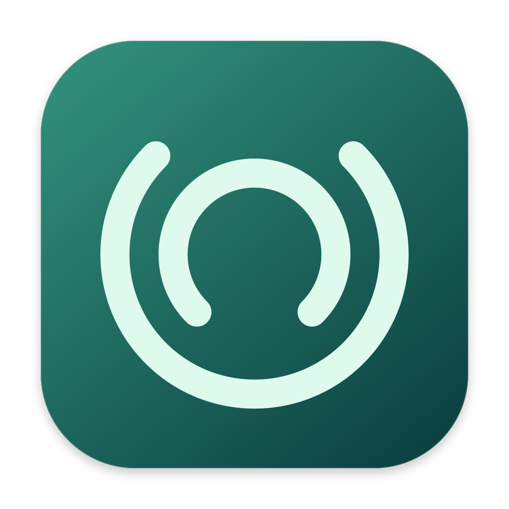
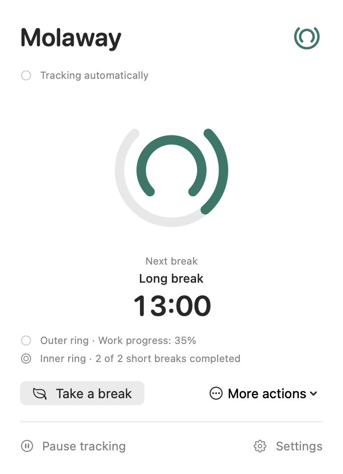
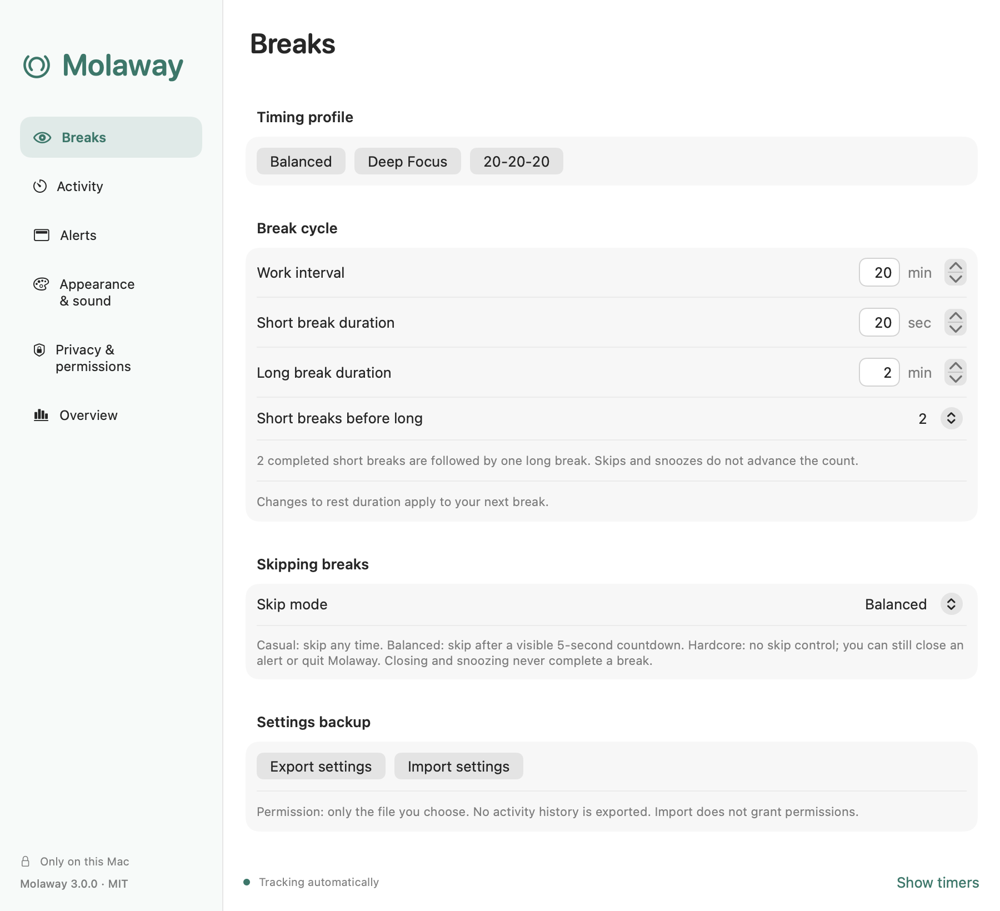
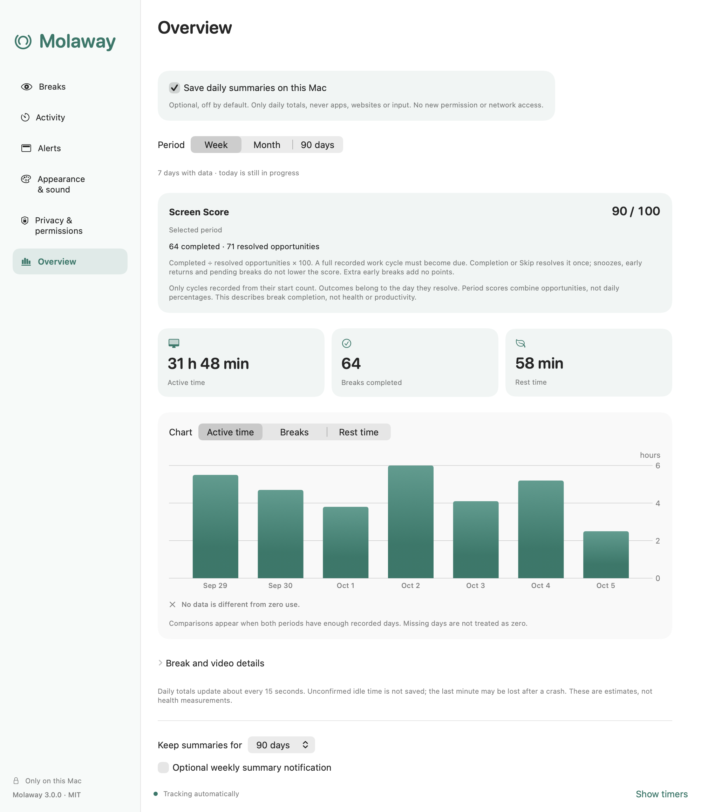

# Molaway

<p align="center"></p>

**Small breaks, a better day.** A local macOS menu bar app with a work/short/long break cycle.

- Plan short rests and longer breaks in one cycle, with a reversible Deep Focus preset.
- Automatically pause when you step away and continue through supported video playback.
- Choose gentle reminders, shared pause options, Office Hours and optional local summaries.
- No account, subscription, ads, analytics or app network access.

[](https://github.com/boorkymoorky/molaway/releases/latest/download/Molaway-3.0.0-macOS-arm64.zip)

**Current release: 3.0.0 · Apple Silicon · macOS 15 or later**

[Release notes](https://github.com/boorkymoorky/molaway/releases/latest) · [Installation guide](docs/INSTALL.md) · [SHA256SUMS.txt](https://github.com/boorkymoorky/molaway/releases/download/v3.0.0/SHA256SUMS.txt)

<p align="center"></p>

*Screenshots show the English 3.0.0 interface with example settings and synthetic summaries.*

## Install

1. Click **Download latest release** above. It downloads the app ZIP, not the source code.
2. Quit any running Molaway, extract the ZIP and drag **Molaway.app** into **Applications**. Keep one installed copy.
3. Open Molaway and click its two-ring menu bar icon.
4. Choose your work interval, short/long rest durations and short-break cadence.

**Upgrading from an earlier version:** export your old settings first and keep that file private. Review the migrated schedule and [migration/downgrade limits](docs/MACOS_3_RELEASE.md). Settings exports are not a full backup, and replacing the app alone is not a lossless rollback.

**Signing:** Molaway is ad hoc signed, **not Apple Developer ID signed or notarized**. Follow Apple's per-app approval steps in the [installation guide](docs/INSTALL.md); keep Gatekeeper enabled.

**Updates are manual:** check [the latest release](https://github.com/boorkymoorky/molaway/releases/latest). Molaway never contacts GitHub or checks for updates in the background. The current app/source downloads and original signature were verified; [release evidence and physical limits](docs/MACOS_3_RELEASE.md) describe the scope.

## Homebrew

The [Molaway-owned Homebrew tap](https://github.com/boorkymoorky/homebrew-molaway) is published. It currently pins an older verified release; the button above downloads the latest app.

Its isolated install, fetch, reinstall and removal checks passed. **First launch after normal Gatekeeper approval remains pending**, so end-user Homebrew commands are withheld until that check passes. Use the download button for 3.0.0. [Tap verification and remaining gate](docs/M10_DISTRIBUTION.md).

**Terminal alternative:** [build and install the versioned source](docs/INSTALL.md#terminal-install-from-source). No paid Apple Developer membership is needed.

## Features

### One break cycle

- Choose a work interval, short and long rest durations, and how many completed short breaks precede a long one.
- **Outer ring = work/rest progress; inner ring = completed-short cadence toward a long break.**
- Deep Focus applies a timing preset and lets you restore your previous custom schedule.
- Shared manual pause options include 30 minutes, one hour, tomorrow and manual resume. Optional Office Hours supports selected weekdays and overnight schedules.
- Casual, Balanced and Hardcore define Skip behavior across reminder surfaces. Skips and snoozes do not advance the completed-short count.
- Automatic idle pause and natural rest follow the current cycle; an unfinished rest is not counted as completed.
- Optional menu bar and pointer countdowns. The pointer badge gives one localized announcement per visible countdown.

<p align="center"></p>

### Smart Pause and reminders

- Supported video playback and manual Watching keep activity counting available; Presentation quiets reminders.
- Optional camera-use/shared Focus suppression, plus off-by-default typing deferral capped at 30 seconds.
- Off-by-default audio-input, active native fullscreen and explicitly selected foreground-app signals quiet alerts within documented public-API limits. They do not record app usage or capture media.
- Four reminder styles: native macOS notification, corner card, top-center panel and full-screen overlay.
- Custom reminders can target every display, the primary display or the cursor's display.
- Adjustable reminder duration, opacity, appearance and full-screen dimming; Reduce Motion and Reduce Transparency are respected.
- English and Turkish, selected from the system language by default. Optional sounds, themes, accents and launch at login.

### Optional local overview

- **Off by default.** Bounded daily totals only, stored on your Mac.
- Active time, completed short/long/natural breaks and rest time in 7/30/90-day charts. Historical eye/movement totals retain their original meaning.
- Screen Score is completed ÷ resolved full-cycle opportunities, shown after at least three outcomes. Snoozes, unresolved opportunities and extra early breaks do not create failures or extra points; old days have no reconstructed score.
- 30- or 90-day retention, user-controlled deletion and optional quiet weekly summaries.
- Settings import/export excludes summaries and cannot grant permissions or enable recording.

<p align="center"></p>

## Privacy and permissions

- App Sandbox and hardened runtime; **no network client or server entitlement**.
- No screen recording, camera/microphone capture, Accessibility, Input Monitoring or Full Disk Access.
- No saved URLs, window titles, keystrokes, captured media or exact activity timeline. Explicitly selected app identifiers are bounded preferences, not usage history.
- Optional permissions cover native notifications, shared Focus, login item and a file/app you explicitly select.
- No background server, privileged helper, browser extension, automatic updater or third-party Swift packages.
- Local data is bounded and validated. Operating-system backups can retain earlier copies.

[Security policy](SECURITY.md) · [Data and detection details](docs/PRIVACY.md) · [Verification](VERIFICATION.md)

## Known limits

- Video and optional quiet signals vary by player, app and OS state. A playing video or running audio input does not prove presence or a meeting. Manual Watching and Presentation remain available.
- Native notifications follow macOS delivery rules. Complete-app notification/actions, keyboard/VoiceOver flows, display/Space/lifecycle combinations and real sleep/lock retain unverified cases.
- Positive optional-signal transitions, multi-day Screen Score use and sustained energy impact retain unverified cases. Structured physical checks remain deferred under daily-use feedback.
- Apple Silicon is the distributed build. Intel and the oldest supported macOS version remain unverified.
- Summaries and Screen Score are estimates, not health or productivity measurements. No promise of zero vulnerabilities or continuous maintenance.

**Windows:** a separate development preview is in progress, with no published installer or release date. It is not a stable Windows release.

## Why I made it

I'm **Burak Yelkenci, not a software developer**. I made Molaway for my own routine: I wanted break reminders that resume automatically, stay quiet when needed and feel comfortable on a Mac. I had been using Pomy 2, but manually restarting after a break and disruptive reminders did not fit how I work.

Molaway is a personal, non-commercial project shared as open source. My version was developed through **vibe coding with ChatGPT/Codex**, on top of **[Offscreen by Dayo Akinkuowo](https://github.com/dayaki/offscreen)**. The original author's work and MIT license are retained. AI assistance and automated tests are not a substitute for an independent security audit.

## Build and contribute

Requires Xcode with the macOS 26+ SDK and Swift 6.2+. Runtime target: macOS 15. No external Swift package downloads are needed.

```sh
bash Scripts/build-app.sh
swift test
python3 Scripts/verify-security.py
python3 Scripts/verify-publication.py
```

The app is created at `build.noindex/Molaway.app`. Use a versioned release tag for a reproducible source build. [Contributing](CONTRIBUTING.md) explains checks and privacy requirements; [Changelog](CHANGELOG.md) lists changes.

## Credits and license

- Based on **[Offscreen](https://github.com/dayaki/offscreen)** by **[Dayo Akinkuowo](https://github.com/dayaki)**, under the [MIT license](LICENSE).
- Molaway modifications: **Burak Yelkenci**, with ChatGPT/Codex assistance.
- [Upstream history and changes](UPSTREAM.md) · [Assets and third-party notices](THIRD_PARTY_NOTICES.md).
- Not affiliated with or endorsed by Offscreen, Apple or OpenAI.
- My purpose is non-commercial; the MIT license still permits others to use the code commercially.
